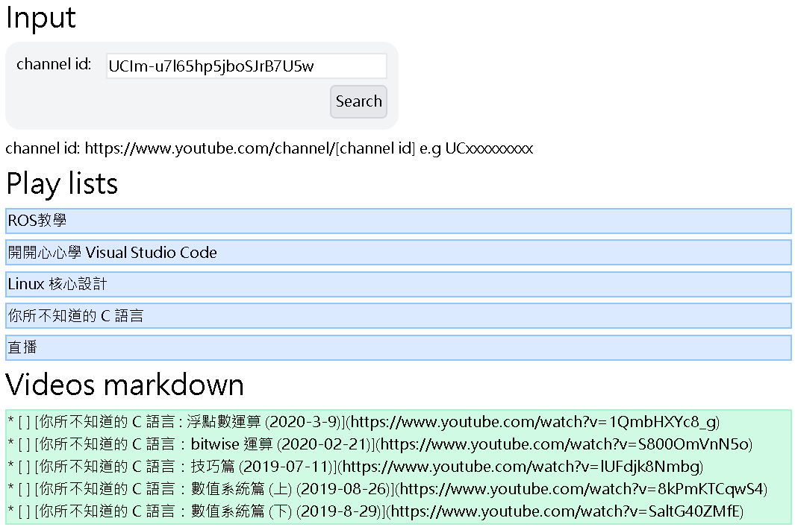

# Youtube list to markdown url

## [Demo](https://moved0311.github.io/youtube-list-to-markdown-url/)

## Results

## How to get youtube channel id

1. Click a channel of your subscription content.
2. Check uri bar. look like `https://www.youtube.com/channel/<channel id>` \
   e.g. `https://www.youtube.com/channel/UCIm-u7l65hp5jboSJrB7U5w`
